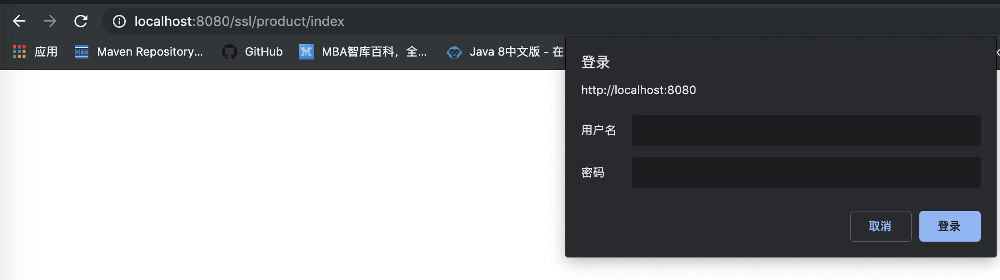
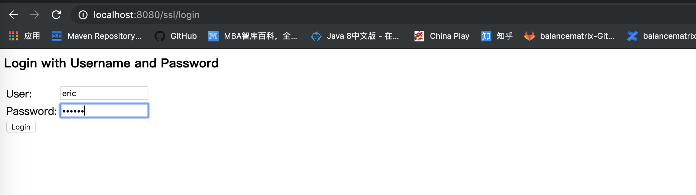

# Spring Security学习

## Spring Security练习1

我目前理解的Spring Security的思想大致如下：
首先是拦截器，它来定义服务器上对哪些资源的访问需要拦截；其次是认证管理器，拦截了之后通过认证管理器来确定客户端是否有权限访问资源

写在前面：
* 该项目是个基于maven构建的web项目
* 使用spring mvc作为web框架,spring mvc相关配置步骤这里就不写了

### 针对http的权限认证配置，初步

1.配置springSecurityFilterChain
web.xml中添加配置：
```xml
  <!-- SpringSecurity过滤器链 -->
  <filter>
    <filter-name>springSecurityFilterChain</filter-name>
    <filter-class>org.springframework.web.filter.DelegatingFilterProxy</filter-class>
  </filter>
  <filter-mapping>
    <filter-name>springSecurityFilterChain</filter-name>
    <url-pattern>/*</url-pattern>
  </filter-mapping>
```

2.配置http拦截器，拦截所有请求
spring-security.xml中添加配置：
```xml
    <security:http>
        <!--
            pattern：需要拦截资源的正则表达式，一个*代表一级路径，两个*代表任意级路径
            isFullyAuthenticated()：该资源需要认证才可以被访问
        -->
        <security:intercept-url pattern="/**" access="isFullyAuthenticated()"/>
    </security:http>
```

3.spring-security.xml中添加配置：
```xml
    <!-- <security:authentication-manager>:认证管理器
            <security:authentication-provider>:认证提供者
                在这里我们配置了<security:user-service>作为认证提供者，它相当于在
                内存中创建了UserDetailsService，并且拥有你配置的用户
    -->
    <security:authentication-manager>
        <security:authentication-provider>
            <security:user-service>
                <security:user name="eric" password="123456"/>
            </security:user-service>
        </security:authentication-provider>
    </security:authentication-manager>
```
到此为止初步的配置就完成了，访问 `localhost:8080/ssl/product/index` 进行测试，弹出登陆窗口

输入用户名eric，密码123456之后即可正常访问

### 登陆方式修改为form-login
1.注释掉http-basic，打开form-login，spring-security.xml配置如下：
```xml
<!-- <security:http-basic/> -->

<!-- 使用表单登陆，默认spring会提供一个表单 -->
<security:form-login/>
```
访问 `localhost:8080/ssl/product/index` 进行测试，弹出表单登陆页面

输入用户名eric，密码123456之后即可正常访问

### 为不同访问路径配置不同认证或授权方式
1.所有路径除了`/product/index`之外都需要进行认证

2.路径`/product/list`需要ROLE_USER权限

3.`/product/add`，`/product/update`，`/product/delete`都需要ROLE_ADMIN权限

来看配置，首先是访问路径的配置，spring-security.xml：
```xml
    <security:http>
        <!-- isAnonymous()是只允许匿名登陆，permitAll()都是允许所有用户访问-->
        <security:intercept-url pattern="/product/index" access="permitAll()"/>

        <security:intercept-url pattern="/product/list" access="hasRole('ROLE_USER')"/>
        <security:intercept-url pattern="/product/add" access="hasRole('ROLE_ADMIN')"/>
        <security:intercept-url pattern="/product/update" access="hasRole('ROLE_ADMIN')"/>
        <security:intercept-url pattern="/product/delete" access="hasRole('ROLE_ADMIN')"/>
        <!--
            pattern：需要拦截资源的正则表达式，一个*代表一级路径，两个*代表任意级路径
            isFullyAuthenticated()：该资源需要认证才可以被访问
        -->
        <security:intercept-url pattern="/**" access="isFullyAuthenticated()"/>
    </security:http>
```
另外还要配置两个用户分别拥有ROLE_USER权限和ROLE_ADMIN权限，spring-security.xml：
```xml
    <security:authentication-manager>
        <security:authentication-provider>
            <security:user-service>
                <security:user name="eric" password="123456" authorities="ROLE_USER"/>
                <security:user name="jack" password="123456" authorities="ROLE_ADMIN"/>
            </security:user-service>
        </security:authentication-provider>
    </security:authentication-manager>
```

### 自定义登陆页面，自定义处理登陆请求的url，自定义权限不足的处理页面
spring-security.xml配置如下：
```xml
   <security:http>
        <!-- isAnonymous()是只允许匿名登陆，permitAll()都是允许所有用户访问-->
        <security:intercept-url pattern="/product/index" access="permitAll()"/>
        <!-- 放通我们自己定义的登陆界面url，否则会无限重定向到该页面 -->
        <security:intercept-url pattern="/userLogin" access="permitAll()"/>
        <security:intercept-url pattern="/product/list" access="hasRole('ROLE_USER')"/>
        <security:intercept-url pattern="/product/add" access="hasRole('ROLE_ADMIN')"/>
        <security:intercept-url pattern="/product/update" access="hasRole('ROLE_ADMIN')"/>
        <security:intercept-url pattern="/product/delete" access="hasRole('ROLE_ADMIN')"/>
        <!--
            pattern：需要拦截资源的正则表达式，一个*代表一级路径，两个*代表任意级路径
            isFullyAuthenticated()：该资源需要认证才可以被访问
        -->
        <security:intercept-url pattern="/**" access="isFullyAuthenticated()"/>

        <!-- 使用表单登陆，默认spring会提供一个表单
            login-page:配置自己的登陆页面，要注意配置了自己的登陆页面之后，它会被拦截，然后就无限进登陆界面，所以我们要
                在上面拦截器配置上放通该url
            login-processing-url:可以配置处理登陆请求的url，默认是/login，参考UsernamePasswordAuthenticationFilter，
                如果改了这个参数，记得要把登陆界面中表单的提交路径改成一致
        -->
        <security:form-login login-page="/userLogin" login-processing-url="/securityLogin"/>

        <!-- 自定义权限不足处理方式 -->
        <security:access-denied-handler error-page="/error"/>

        <!-- 关闭csrf，否则post请求都要求参数中有_csrf，而我们提供的登陆界面中的登陆表单并没有_csrf字段，就会报错-->
        <security:csrf disabled="true"/>
    </security:http>
```
这里有几点需要注意以下：
* 配置了自定义登陆页面login-page之后要把我们配置的url从拦截器中排除，否则会无限重定向到该url
* 配置了自定义登陆请求处理url login-processing-url之后，要注意把登陆界面的提交路径也一并改掉
* spring security对所有post请求参数中都要求有_csrf字段，而我们自定义的登陆页面表单中并没有该字段，所以暂时把这功能关了

### 使用自定义UserDetailService
1.实现UserDetailService
```java
public class MyUserDetailService implements UserDetailsService {
    @Override
    public UserDetails loadUserByUsername(String username) throws UsernameNotFoundException {
        // User是spring security提供的UserDetails的实现类
        User user = new User("eric", "123456",
                AuthorityUtils.commaSeparatedStringToAuthorityList("ROLE_USER"));
        return user;
    }
}
```

2.spring-security.xml配置
```xml
    <security:authentication-manager>
        <security:authentication-provider user-service-ref="myUserDetailService">
        </security:authentication-provider>
    </security:authentication-manager>

    <bean id="myUserDetailService" class="org.yj.security.MyUserDetailService"/>
```

### 自定义认证成功与失败处理逻辑
1.实现AuthenticationSuccessHandler
```java
public class MyAuthenticationSuccessHandler implements AuthenticationSuccessHandler {

    /**
     * ObjectMapper:jackson框架工具类，用于转换对象为json字符串
     */
    private ObjectMapper objectMapper = new ObjectMapper();

    @Override
    public void onAuthenticationSuccess(HttpServletRequest request, HttpServletResponse response, Authentication authentication) throws IOException, ServletException {
        Map<String, Object> result = new HashMap();
        result.put("success", true);
        String json = objectMapper.writeValueAsString(result);
        response.setContentType("text/json;charset=utf-8");
        response.getWriter().write(json);
    }
}
```

2.实现AuthenticationFailureHandler
```java
public class MyAuthenticationFailHandler implements AuthenticationFailureHandler {
    /**
     * ObjectMapper:jackson框架工具类，用于转换对象为json字符串
     */
    private ObjectMapper objectMapper = new ObjectMapper();

    @Override
    public void onAuthenticationFailure(HttpServletRequest request, HttpServletResponse response, AuthenticationException exception) throws IOException, ServletException {
        Map<String, Object> result = new HashMap();
        result.put("success", true);
        String json = objectMapper.writeValueAsString(result);
        response.setContentType("text/json;charset=utf-8");
        response.getWriter().write(json);
    }
}
```

3.配置spring-security.xml
```xml
    <security:http>
        <!-- isAnonymous()是只允许匿名登陆，permitAll()都是允许所有用户访问-->
        <security:intercept-url pattern="/product/index" access="permitAll()"/>
        <!-- 放通我们自己定义的登陆界面url，否则会无限重定向到该页面 -->
        <security:intercept-url pattern="/userLogin" access="permitAll()"/>
        <security:intercept-url pattern="/product/list" access="hasRole('ROLE_USER')"/>
        <security:intercept-url pattern="/product/add" access="hasRole('ROLE_ADMIN')"/>
        <security:intercept-url pattern="/product/update" access="hasRole('ROLE_ADMIN')"/>
        <security:intercept-url pattern="/product/delete" access="hasRole('ROLE_ADMIN')"/>
        <!--
            pattern：需要拦截资源的正则表达式，一个*代表一级路径，两个*代表任意级路径
            isFullyAuthenticated()：该资源需要认证才可以被访问
        -->
        <security:intercept-url pattern="/**" access="isFullyAuthenticated()"/>

        <!-- 使用表单登陆，默认spring会提供一个表单
            login-page:配置自己的登陆页面，要注意配置了自己的登陆页面之后，它会被拦截，然后就无限进登陆界面，所以我们要
                在上面拦截器配置上放通该url
            login-processing-url:可以配置处理登陆请求的url，默认是/login，参考UsernamePasswordAuthenticationFilter，
                如果改了这个参数，记得要把登陆界面中表单的提交路径改成一致
        -->
        <security:form-login login-page="/userLogin" login-processing-url="/securityLogin"
                             authentication-success-handler-ref="myAuthenticationSuccessHandler"
                             authentication-failure-handler-ref="myAuthenticationFailHandler"/>

        <!-- 自定义权限不足处理方式 -->
        <security:access-denied-handler error-page="/error"/>

        <!-- 关闭csrf，否则post请求都要求参数中有_csrf，而我们提供的登陆界面中的登陆表单并没有_csrf字段，就会报错-->
        <security:csrf disabled="true"/>
    </security:http>
    
    
    <bean id="myAuthenticationSuccessHandler" class="org.yj.security.MyAuthenticationSuccessHandler"/>

    <bean id="myAuthenticationFailHandler" class="org.yj.security.MyAuthenticationFailHandler"/>
```